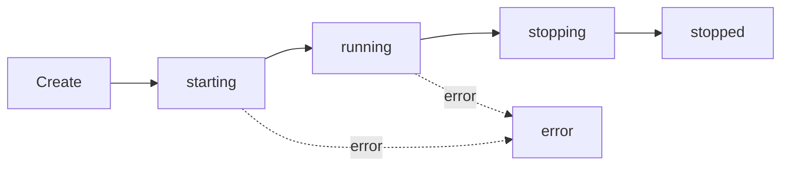

Instances are **running Chrome browser processes** managed by PinchTab. Each instance is completely isolated with its own browser state, profile, and port allocation.

## Overview

An instance represents:
- One Chrome/Chromium browser process
- Optional browser profile (user data directory)
- Auto-allocated unique port (9868-9968 range)
- Multiple browser tabs
- Complete isolation from other instances

<Info>
Instances are identified by hash-based IDs: `inst_XXXXXXXX` (stable across restarts when using named profiles)
</Info>

## Key Concepts

### Lazy Initialization

Instances use **lazy Chrome initialization** for optimal performance:

- Creation is instant (status: `starting`)
- Chrome launches on first request (5-20 seconds)
- Status transitions to `running` when ready
- No wasted resources for unused instances

```bash
# Instance created immediately
curl -X POST http://localhost:9867/instances/start
# {"id":"inst_0a89a5bb","status":"starting",...}

# Chrome initializes on first operation
curl http://localhost:9867/instances/inst_0a89a5bb/health
# Triggers Chrome launch (8-20 seconds)

# Check status
curl http://localhost:9867/instances/inst_0a89a5bb | jq .status
# "running"
```

### Port Allocation

Ports are auto-allocated from the range **9868-9968** (configurable):

```go
// Source: internal/orchestrator/orchestrator.go:118
portAllocator: NewPortAllocator(9868, 9968)
```

<Steps>
  <Step title="Request instance creation">
    PinchTab finds first available port in range
  </Step>
  <Step title="Verify availability">
    Checks port is not in use by system or other instances
  </Step>
  <Step title="Allocate and track">
    Reserves port and returns instance info
  </Step>
</Steps>

## Creating Instances

### Basic Instance

```bash
# CLI (headless by default)
pinchtab instance start

# API
curl -X POST http://localhost:9867/instances/start \
  -H "Content-Type: application/json" \
  -d '{}'
```

**Response:**
```json
{
  "id": "inst_0a89a5bb",
  "profileId": "prof_278be873",
  "profileName": "instance-temp-abc",
  "port": "9868",
  "headless": true,
  "status": "starting",
  "startTime": "2026-03-01T05:21:38.274Z"
}
```

### With Specific Profile

```bash
# Create persistent profile first
pinchtab profile create work

# Start instance with profile
curl -X POST http://localhost:9867/instances/start \
  -d '{"profileId": "work"}'
```

### Headed Mode (Visible Window)

```bash
# CLI
pinchtab instance start --mode headed

# API
curl -X POST http://localhost:9867/instances/start \
  -d '{"mode": "headed"}'
```

<Note>
Headed mode requires a display server (X11/Wayland on Linux, native on macOS/Windows)
</Note>

### Custom Port

```bash
curl -X POST http://localhost:9867/instances/start \
  -d '{"port": "9999"}'
```

<Warning>
Manually specifying ports can cause conflicts. Let PinchTab auto-allocate when possible.
</Warning>

## Instance Lifecycle



### Status Values

| Status | Description | Next State |
|--------|-------------|------------|
| `starting` | Chrome initializing, health checks running | `running` or `error` |
| `running` | Ready to accept commands | `stopping` |
| `stopping` | Graceful shutdown in progress | `stopped` |
| `stopped` | Process terminated, instance removed | - |
| `error` | Failed to start or crashed | - |

## Instance Operations

### List All Instances

```bash
# CLI
pinchtab instances

# API
curl http://localhost:9867/instances | jq .
```

**Response:**
```json
[
  {
    "id": "inst_0a89a5bb",
    "profileId": "prof_278be873",
    "profileName": "work",
    "port": "9868",
    "headless": false,
    "status": "running",
    "startTime": "2026-03-01T05:21:38.274Z"
  }
]
```

### Get Instance Info

```bash
curl http://localhost:9867/instances/inst_0a89a5bb | jq .
```

### View Logs

```bash
# CLI
pinchtab instance logs inst_0a89a5bb

# API
curl http://localhost:9867/instances/inst_0a89a5bb/logs
```

Logs include:
- Chrome process startup
- Health check results
- Port allocation
- Error diagnostics

### Stop Instance

```bash
# CLI
pinchtab instance stop inst_0a89a5bb

# API
curl -X POST http://localhost:9867/instances/inst_0a89a5bb/stop
```

Stopping an instance:
1. Sends graceful shutdown signal
2. Waits up to 5 seconds
3. Force kills if needed
4. Releases port allocation
5. Removes instance from registry
6. **Preserves profile data**

```go
// Source: internal/orchestrator/orchestrator.go:251-312
// Graceful shutdown sequence:
// 1. POST /shutdown to instance (4s timeout)
// 2. Wait for process exit (5s)
// 3. Send SIGTERM (3s)
// 4. Send SIGKILL (2s)
// 5. Force cancel context
```

## Multiple Instances

Run multiple isolated instances simultaneously:

```bash
# Start 3 headless instances
for i in 1 2 3; do
  pinchtab instance start --mode headless
done

# List all
curl http://localhost:9867/instances | jq 'length'
# 3

# Each has unique port
curl http://localhost:9867/instances | jq '.[].port'
# "9868"
# "9869" 
# "9870"
```

### Use Cases for Multiple Instances

<CardGroup cols={2}>
  <Card title="Multi-User Testing" icon="users">
    Simulate different user accounts with isolated sessions
  </Card>
  <Card title="Parallel Execution" icon="bolt">
    Scale automation by running tasks concurrently
  </Card>
  <Card title="A/B Testing" icon="flask">
    Test different configurations side-by-side
  </Card>
  <Card title="Load Testing" icon="chart-line">
    Simulate multiple concurrent users
  </Card>
</CardGroup>

## Best Practices

### Wait for Ready State

```bash
# Create instance
INST=$(curl -s -X POST http://localhost:9867/instances/start | jq -r .id)

# Poll until running
while [ "$(curl -s http://localhost:9867/instances/$INST | jq -r .status)" != "running" ]; do
  echo "Waiting..."
  sleep 0.5
done

# Now safe to use
curl -X POST http://localhost:9867/instances/$INST/tabs/open \
  -d '{"url":"https://example.com"}'
```

### Profile Management

```bash
# Temporary instance (auto-deleted on stop)
pinchtab instance start

# Persistent instance (profile preserved)
pinchtab profile create persistent
pinchtab instance start --profileId persistent
```

<Tip>
Use temporary instances for testing, persistent profiles for production workflows
</Tip>

### Resource Cleanup

```bash
# Always stop instances when done
for inst in $(curl -s http://localhost:9867/instances | jq -r '.[].id'); do
  pinchtab instance stop $inst
done
```

### Port Configuration

```bash
# Set custom port range (orchestrator level)
BRIDGE_PORT_MIN=10000 BRIDGE_PORT_MAX=10100 pinchtab
```

```go
// Source: internal/orchestrator/orchestrator.go:129-130
func (o *Orchestrator) SetPortRange(start, end int) {
	o.portAllocator = NewPortAllocator(start, end)
}
```

## Monitoring Instances

### Health Checks

Instances are monitored continuously:

```go
// Source: internal/orchestrator/health.go
// Health monitor checks every 1 second:
// - Process alive
// - HTTP endpoint responding
// - Chrome DevTools Protocol accessible
```

### Instance Metrics

```bash
curl http://localhost:9867/instances/inst_0a89a5bb/metrics
```

**Response:**
```json
{
  "instanceId": "inst_0a89a5bb",
  "profileName": "work",
  "jsHeapUsedMB": 45.2,
  "jsHeapTotalMB": 128.0,
  "documents": 3,
  "frames": 5,
  "nodes": 1247,
  "listeners": 89
}
```

## Error Handling

### Port Already in Use

```json
{
  "error": "port 9868 already in use by instance 'work'",
  "statusCode": 409
}
```

**Solution:** Let PinchTab auto-allocate or specify different port

### Profile Already Active

```json
{
  "error": "profile 'work' already has an active instance",
  "statusCode": 409  
}
```

**Solution:** Stop existing instance or use different profile

### Chrome Failed to Start

Check logs for diagnostics:

```bash
pinchtab instance logs inst_0a89a5bb
```

Common causes:
- Chrome binary not found
- Display server not available (headed mode on headless server)
- Insufficient memory
- Profile directory permissions

## Advanced Configuration

### Custom Chrome Flags

```bash
# Set via environment
BRIDGE_CHROME_FLAGS="--disable-gpu --no-sandbox" pinchtab
```

### Instance Timeout

```go
// Source: internal/orchestrator/orchestrator.go:116
// Client timeout for instance operations: 60 seconds
// Allows time for:
// - Chrome initialization (8-20s)
// - Navigation (up to 60s)
// - Long-running operations
client: &http.Client{Timeout: 60 * time.Second}
```

## Next Steps

<CardGroup cols={2}>
  <Card title="Browser Profiles" href="/features/profiles" icon="user">
    Learn about persistent browser state
  </Card>
  <Card title="Tab Management" href="/features/tabs" icon="window">
    Control browser tabs within instances
  </Card>
  <Card title="Headless vs Headed" href="/features/headless-vs-headed" icon="eye">
    Choose the right mode for your use case
  </Card>
  <Card title="Instance API" href="/api/instances" icon="code">
    Complete API reference
  </Card>
</CardGroup>
