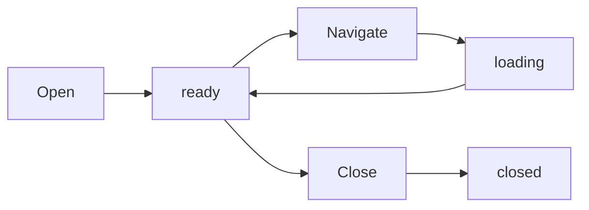

Tabs are **individual browser pages** within an instance. Each tab has its own URL, DOM, and execution context.

## Overview

A tab represents:
- Single webpage with independent DOM
- Unique tab ID: `tab_XXXXXXXX`
- Belongs to exactly one instance
- Inherits instance's profile and cookies
- Supports full browser automation (navigate, click, type, snapshot, etc.)

<Info>
Tab IDs are hash-based identifiers derived from Chrome DevTools Protocol target IDs
</Info>

## Creating Tabs

### Open New Tab

```bash
# CLI
pinchtab tab open inst_0a89a5bb https://example.com

# API
curl -X POST http://localhost:9867/instances/inst_0a89a5bb/tabs/open \
  -H "Content-Type: application/json" \
  -d '{"url": "https://example.com"}'
```

**Response:**
```json
{
  "tabId": "tab_abc123",
  "url": "https://example.com",
  "title": "Example Domain"
}
```

### Open Blank Tab

```bash
# Open tab without URL
curl -X POST http://localhost:9867/instances/inst_0a89a5bb/tabs/open \
  -d '{}'
```

Tab opens with `about:blank` and is ready for navigation.

## Listing Tabs

### All Tabs

```bash
# CLI
pinchtab tabs

# API  
curl http://localhost:9867/tabs | jq .
```

**Response:**
```json
[
  {
    "id": "tab_abc123",
    "instanceId": "inst_0a89a5bb",
    "url": "https://example.com",
    "title": "Example Domain"
  },
  {
    "id": "tab_def456",
    "instanceId": "inst_1b9a5dcc",
    "url": "https://google.com",
    "title": "Google"
  }
]
```

### Tabs in Specific Instance

```bash
curl "http://localhost:9867/tabs?instanceId=inst_0a89a5bb" | jq .
```

```go
// Source: internal/orchestrator/orchestrator.go:445-471
func (o *Orchestrator) AllTabs() []bridge.InstanceTab {
    // Fetches tabs from all running instances
    instances := make([]*InstanceInternal, 0)
    for _, inst := range o.instances {
        if inst.Status == "running" && instanceIsActive(inst) {
            instances = append(instances, inst)
        }
    }
    // ...
}
```

## Tab Information

### Get Tab Details

```bash
# CLI
pinchtab tab info tab_abc123

# API
curl http://localhost:9867/tabs/tab_abc123 | jq .
```

**Response:**
```json
{
  "id": "tab_abc123",
  "instanceId": "inst_0a89a5bb",
  "url": "https://example.com",
  "title": "Example Domain",
  "status": "ready"
}
```

### Tab Status Values

| Status | Description |
|--------|-------------|
| `ready` | Tab loaded and ready for commands |
| `loading` | Navigating to new URL |
| `error` | Failed to load |

## Navigating Tabs

```bash
# Navigate to URL
curl -X POST http://localhost:9867/tabs/tab_abc123/navigate \
  -d '{"url": "https://google.com"}'

# With timeout
curl -X POST http://localhost:9867/tabs/tab_abc123/navigate \
  -d '{"url": "https://example.com", "timeout": 30}'
```

<Note>
Navigation uses the instance's cookies and browser state from its profile
</Note>

## Closing Tabs

```bash
# CLI
pinchtab tab close tab_abc123

# API
curl -X POST http://localhost:9867/tabs/tab_abc123/close
```

**Response:**
```json
{
  "id": "tab_abc123",
  "status": "closed"
}
```

```go
// Source: internal/orchestrator/handlers_tabs.go:16-57
func (o *Orchestrator) handleTabClose(w http.ResponseWriter, r *http.Request) {
    tabID := r.PathValue("id")
    
    // Find instance containing this tab
    inst, err := o.findRunningInstanceByTabID(tabID)
    
    // Send close request to instance
    reqBody, _ := json.Marshal(map[string]string{
        "action": "close",
        "tabId":  tabID,
    })
    // ...
}
```

## Tab Operations

### Take Snapshot

Get structured DOM representation:

```bash
curl "http://localhost:9867/tabs/tab_abc123/snapshot?interactive=true&compact=true" | jq .
```

**Response:**
```json
{
  "url": "https://example.com",
  "title": "Example Domain",
  "elements": [
    {
      "ref": "e0",
      "tag": "h1",
      "text": "Example Domain",
      "interactive": false
    },
    {
      "ref": "e1",
      "tag": "a",
      "text": "More information...",
      "href": "https://www.iana.org/domains/example",
      "interactive": true
    }
  ]
}
```

### Take Screenshot

```bash
# Save screenshot
curl http://localhost:9867/tabs/tab_abc123/screenshot > page.png

# CLI
pinchtab tab screenshot tab_abc123 -o page.png
```

### Execute Actions

```bash
# Click element
curl -X POST http://localhost:9867/tabs/tab_abc123/action \
  -d '{"kind": "click", "ref": "e5"}'

# Type text
curl -X POST http://localhost:9867/tabs/tab_abc123/action \
  -d '{"kind": "type", "ref": "e12", "text": "search query"}'

# Press key
curl -X POST http://localhost:9867/tabs/tab_abc123/action \
  -d '{"kind": "press", "key": "Enter"}'
```

### Get Page Text

```bash
curl http://localhost:9867/tabs/tab_abc123/text
```

**Response:**
```json
{
  "text": "Example Domain\nThis domain is for use in illustrative examples...",
  "length": 1247
}
```

### Evaluate JavaScript

```bash
curl -X POST http://localhost:9867/tabs/tab_abc123/evaluate \
  -d '{"expression": "document.title"}'
```

**Response:**
```json
{
  "result": "Example Domain",
  "type": "string"
}
```

## Tab Lifecycle



### Lifecycle Events

<Steps>
  <Step title="Tab Creation">
    POST /instances/{id}/tabs/open creates tab
  </Step>
  <Step title="Initial Load">
    Tab navigates to URL (if provided) or shows blank page
  </Step>
  <Step title="Ready State">
    Tab is ready for commands (navigate, snapshot, actions)
  </Step>
  <Step title="Operations">
    Perform automation tasks on the tab
  </Step>
  <Step title="Close">
    POST /tabs/{id}/close removes tab from instance
  </Step>
</Steps>

## Multiple Tabs

Manage multiple tabs within a single instance:

```bash
#!/bin/bash

# Start instance
INST=$(pinchtab instance start --mode headed | jq -r .id)

# Open multiple tabs
TAB1=$(curl -s -X POST http://localhost:9867/instances/$INST/tabs/open \
  -d '{"url":"https://example.com"}' | jq -r .tabId)

TAB2=$(curl -s -X POST http://localhost:9867/instances/$INST/tabs/open \
  -d '{"url":"https://google.com"}' | jq -r .tabId)

TAB3=$(curl -s -X POST http://localhost:9867/instances/$INST/tabs/open \
  -d '{"url":"https://github.com"}' | jq -r .tabId)

# List all tabs in instance
curl -s "http://localhost:9867/tabs?instanceId=$INST" | \
  jq '.[] | {id, url, title}'

# Close specific tab
curl -X POST http://localhost:9867/tabs/$TAB1/close
```

<Tip>
Tabs in the same instance share cookies and session state from the profile
</Tip>

## Tab Hierarchy

```text
PinchTab Orchestrator
  ├── Instance 1 (inst_0a89a5bb, profile: work)
  │   ├── Tab 1 (tab_abc123, https://example.com)
  │   ├── Tab 2 (tab_abc124, https://google.com)
  │   └── Tab 3 (tab_abc125, https://github.com)
  │
  └── Instance 2 (inst_1b9a5dcc, profile: personal)
      ├── Tab 1 (tab_def001, https://gmail.com)
      └── Tab 2 (tab_def002, https://twitter.com)
```

**Key relationships:**
- Every tab belongs to exactly one instance
- Tabs inherit profile from their instance
- Tabs share cookies within same instance
- Tabs are isolated across different instances

## Tab Security

### Hash-Based IDs

Tab IDs are hashed to prevent:
- Guessing tab identifiers
- Cross-instance tab access
- Information leakage about Chrome internals

```text
Chrome CDP Target ID (internal):
E4F5A6B7-C8D9-0E1F-2A3B-4C5D6E7F8A9B

PinchTab Tab ID (exposed):
tab_e4f5a6b7
└─┬─┘└──┬───┘
  │     └── 8-char hash of CDP target ID
  └──────── Resource type prefix
```

<Warning>
Raw CDP target IDs (32-character hex strings) are rejected with 404. Only hash-format IDs are accepted.
</Warning>

## Common Workflows

### Sequential Navigation

Navigate through multiple pages in one tab:

```bash
# Create tab
TAB=$(curl -s -X POST http://localhost:9867/instances/$INST/tabs/open | jq -r .tabId)

# Navigate through sites
for url in "example.com" "google.com" "github.com"; do
  curl -s -X POST http://localhost:9867/tabs/$TAB/navigate \
    -d "{\"url\":\"https://$url\"}"
  sleep 2
done
```

### Parallel Browsing

Open multiple tabs simultaneously:

```bash
URLS=("example.com" "google.com" "github.com")

for url in "${URLs[@]}"; do
  curl -s -X POST http://localhost:9867/instances/$INST/tabs/open \
    -d "{\"url\":\"https://$url\"}" &
done

wait
```

### Form Automation

```bash
# Open tab
TAB=$(curl -s -X POST http://localhost:9867/instances/$INST/tabs/open \
  -d '{"url":"https://example.com/login"}' | jq -r .tabId)

sleep 2

# Get snapshot to find form elements
curl -s "http://localhost:9867/tabs/$TAB/snapshot?interactive=true" | jq .

# Fill form (assuming element refs from snapshot)
curl -X POST http://localhost:9867/tabs/$TAB/action \
  -d '{"kind":"type","ref":"e3","text":"username"}'

curl -X POST http://localhost:9867/tabs/$TAB/action \
  -d '{"kind":"type","ref":"e4","text":"password"}'

curl -X POST http://localhost:9867/tabs/$TAB/action \
  -d '{"kind":"click","ref":"e5"}'
```

## Best Practices

### Resource Management

```bash
# Always close tabs when done
curl -X POST http://localhost:9867/tabs/$TAB_ID/close

# Or close all tabs in instance before stopping
for tab in $(curl -s "http://localhost:9867/tabs?instanceId=$INST" | jq -r '.[].id'); do
  curl -X POST http://localhost:9867/tabs/$tab/close
done
```

### Error Handling

```bash
# Check if tab exists before operating
if curl -s http://localhost:9867/tabs/$TAB_ID | jq -e .id > /dev/null; then
  echo "Tab exists"
else
  echo "Tab not found"
  exit 1
fi
```

### Wait for Load

```bash
# Navigate
curl -X POST http://localhost:9867/tabs/$TAB_ID/navigate \
  -d '{"url":"https://example.com"}'

# Wait for page to load
sleep 2

# Then take action
curl http://localhost:9867/tabs/$TAB_ID/snapshot
```

## Troubleshooting

### Tab Not Found (404)

**Cause:** Tab closed or never existed

**Solution:**
```bash
# List all tabs to verify
curl http://localhost:9867/tabs | jq '.[] | {id, url}'

# Create new tab if needed
curl -X POST http://localhost:9867/instances/$INST/tabs/open
```

### Instance Not Running (503)

**Cause:** Instance stopped or crashed

**Solution:**
```bash
# Check instance status
curl http://localhost:9867/instances | jq '.[] | {id, status}'

# Restart instance
pinchtab instance start --profileId work
```

### Navigation Timeout

**Cause:** Page taking too long to load

**Solution:**
```bash
# Increase timeout (default 60s)
curl -X POST http://localhost:9867/tabs/$TAB_ID/navigate \
  -d '{"url":"https://slow-site.com","timeout":120}'
```

## Next Steps

<CardGroup cols={2}>
  <Card title="Browser Instances" href="/features/instances" icon="browser">
    Create instances to host tabs
  </Card>
  <Card title="Browser Automation" href="/guides/automation" icon="robot">
    Automate browser interactions
  </Card>
  <Card title="Tabs API" href="/api-reference/tabs" icon="code">
    Complete tab API reference
  </Card>
  <Card title="DOM Snapshots" href="/guides/snapshots" icon="camera">
    Extract page structure
  </Card>
</CardGroup>
